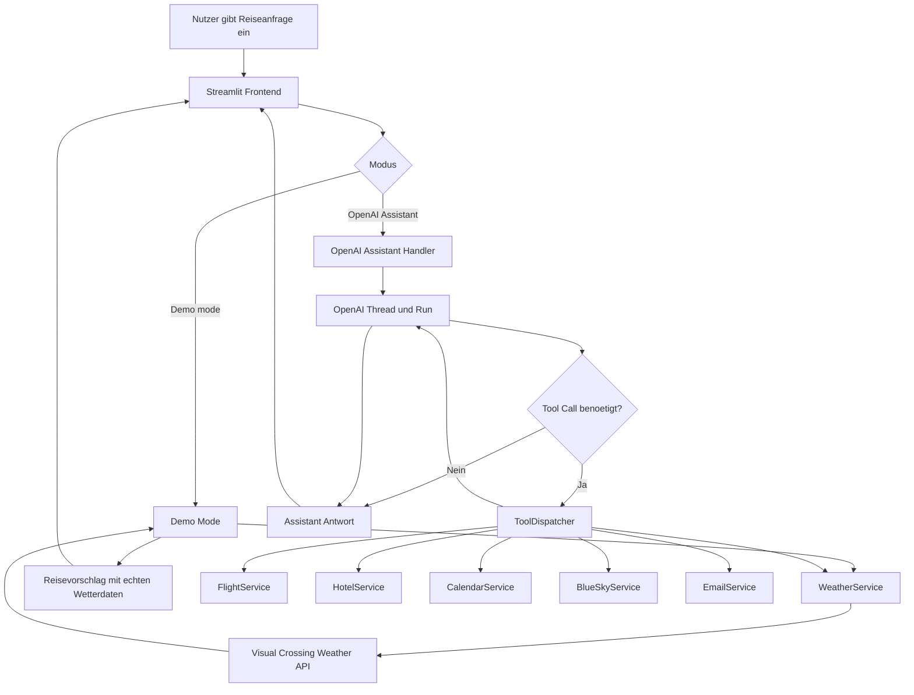
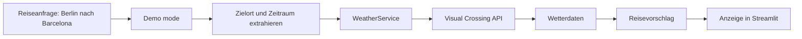

# Smart Journey AI - Architektur und Ablauf

## Systemarchitektur



## Pseudocode

```text
User schreibt Reiseanfrage
Streamlit zeigt Anfrage im Chat

wenn Demo mode aktiv:
    Reiseziel und Datum aus Text erkennen
    Wetterdaten fuer Reiseziel abrufen
    Reisevorschlag mit Wetterbewertung erzeugen
    Antwort im Chat anzeigen

wenn OpenAI Assistant aktiv:
    Nachricht an OpenAI Thread senden
    Assistant Run starten
    solange Run nicht fertig:
        Status pruefen
        wenn Tool Call angefordert:
            ToolDispatcher ruft passende Service-Funktion auf
            Ergebnis an Assistant zurueckgeben
    finale Assistant-Antwort im Chat anzeigen
```

## Aktueller MVP-Ablauf



## Tool- und Datenquellen

| Bereich | Implementierung | Status |
|---|---|---|
| Wetter | Visual Crossing API | funktioniert live |
| OpenAI | Assistant API / Tool Calling | eingerichtet, Quota/Billing abhaengig |
| Flug | Swoodoo-Scraping | technisch vorhanden, aber instabil |
| Hotel | Booking.com-Scraping | technisch vorhanden, aber instabil |
| BlueSky | atproto / BlueSky API | vorbereitet, Read-Test sicher |
| Kalender | Google Calendar API | vorbereitet |
| E-Mail | SMTP + ICS | vorbereitet, nur kontrolliert testen |

## Einordnung

Der wichtigste Punkt ist nicht, dass alle externen Quellen perfekt funktionieren, sondern dass jede Quelle technisch geprueft und bewertet wurde. Fuer stabile Live-Demos wird aktuell die Wetter-API verwendet. Flug und Hotel sind als Services vorhanden, muessen fuer die Endpraesentation aber entweder ueber stabilere APIs oder ueber kontrollierte Fallback-Daten abgesichert werden.

